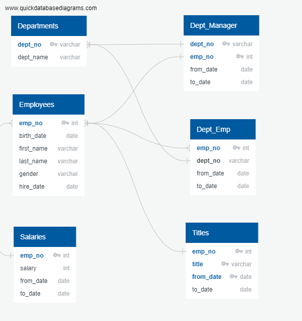
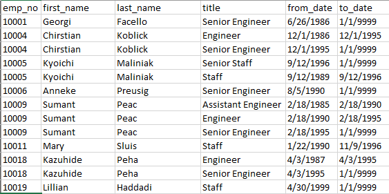
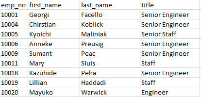
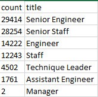
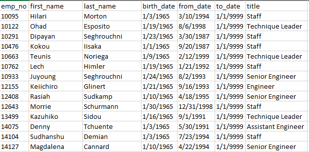
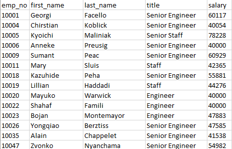

# Pewlett-Hackard-Analysis

## Overview
Several employees are approaching retirement age at fictional tech giant Pewlett Hackard.  In order to assist senior leadership in preparing for this "silver tsunami", PH needs to determine the number of retiring employees.  Senior leadership at PH would also like to fill these positions with up-and-coming star employees and allow them the opportunity to gain institutional knowledge and additional skills, so they have also asked for employees who are eligible to participate in a mentorship program.


## Resources:
- Software:
    - Postgresql
    - pgAdmin
- Data Sources:
    - [departments.csv](https://github.com/acfthomson/Pewlett-Hackard-Analysis/tree/main/Data)
    - [dept_emp.csv](https://github.com/acfthomson/Pewlett-Hackard-Analysis/tree/main/Data)
    - [dept_manager.csv](https://github.com/acfthomson/Pewlett-Hackard-Analysis/tree/main/Data)
    - [employee.csv](https://github.com/acfthomson/Pewlett-Hackard-Analysis/tree/main/Data)
    - [salaries.csv](https://github.com/acfthomson/Pewlett-Hackard-Analysis/tree/main/Data)
    - [titles.csv](https://github.com/acfthomson/Pewlett-Hackard-Analysis/tree/main/Data)
    
    
## Results
Using queries and joins to create a list of retiring PH employees and employees eligible for PH's mentorship program, it was important to first understand the relationship between the various tables in the PH-EmployeeDB.  Using an Entity Relationship Diagram (ERD) allowed the database admins and analysts to quickly determine how the data is connected, the data types, and primary keys.

### PH-Employee DB ERD


###
In order to determine the number of employees approaching retirement eligibility, a new table, [retirement_titles.csv](https://github.com/acfthomson/Pewlett-Hackard-Analysis/tree/main/Data/retirement_titles.csv) was created by using the following query:
``` SQL
SELECT e.emp_no,
	   e.first_name,
	   e.last_name,
	   t.title,
	   t.from_date,
	   t.to_date
INTO retirement_titles
FROM employees AS e
LEFT JOIN titles AS t
ON (e.emp_no = t.emp_no)
WHERE (e.birth_date BETWEEN '1952-01-01' AND '1955-12-31')
ORDER BY e.emp_no, title;
```
This resulted in a table with 133,776 rows and several thousand duplicate name entries.  This was due to an employee changing job titles within PH.



Within the [retirement_titles.csv](https://github.com/acfthomson/Pewlett-Hackard-Analysis/tree/main/Data), we are able to see how an employee has progressed through their career at PH.  Many have changed job titles at least once during their career.  This table allows us to see how long an employee was in each position they held, which could be used for further analysis in determinig average time in a position for certain career paths.

The next step in determining which employees were approaching retirement and what department they currently worked in, a query was written to output the most recent job title for each employee:
``` SQL
SELECT DISTINCT ON (emp_no) emp_no,
first_name,
last_name,
title
INTO unique_titles
FROM retirement_titles
ORDER BY emp_no, to_date DESC;
```
The unique_titles table created contained 90,398 employees approaching retirement.  


Within the [unique_titles.csv](https://github.com/acfthomson/Pewlett-Hackard-Analysis/tree/main/Data), we can see the most recent job title for each employee approaching retirement.

With the data from these two new tables, we were able to retrieve the number of employees by most recent job title that were about to retire.  The following query was used:
``` SQL
SELECT count(title), title
INTO retiring_titles
FROM unique_titles
GROUP BY title
ORDER BY COUNT DESC;
```
The retiring_titles table gave us the following data:



Looking at [unique_titles.csv](https://github.com/acfthomson/Pewlett-Hackard-Analysis/tree/main/Data), we can see what the breakdown is of each job title retiring:
- Senior Engineer: 32.5%
- Senior Staff: 31.3%
- Engineer: 15.7%
- Staff: 13.5%
- Technique Leader: 5.0%
- Assistant Engineer: 1.9%
- Manager: 0.0%

Lastly, we were asked to find employees that are eligible tp participate in PH's mentorship program.  THe goal of this program is to train star employees to fill the positions of retiring employees.  The following query was used:
```SQL
SELECT DISTINCT ON (e.emp_no) e.emp_no,
       e.first_name,
	   e.last_name,
	   e.birth_date,
	   de.from_date,
	   de.to_date,
	   t.title
INTO mentorship_eligibility
FROM employees AS e
INNER JOIN dept_emp as de
ON (e.emp_no = de.emp_no)
INNER JOIN titles as t
ON (e.emp_no = t.emp_no)
WHERE (e.birth_date BETWEEN '1965-01-01' AND '1965-12-31')
AND (de.to_date = '9999-01-01')
ORDER BY e.emp_no;
```
A sample of the mentorship_eligibility table is below:


 
We found that there are 1,549 employees eligible for PH's mentorship program.  The [mentorship_eligibility.csv](https://github.com/acfthomson/Pewlett-Hackard-Analysis/tree/main/Data) lists every eligible employee, their date of birth, start date, and their current job title.

If all 1,549 employees participate and complete PH's mentorship program, this will account for filling only 1.7% of positions that will be vacated by retiring employees.  There is certainly enough retiring employees to assist in mentoring more junior employees for their positions.


Additional tables that could be created and queries performed are as follows:
In order to create a new table that shows the salaries of all retiring employees, the following query should be used:
``` SQL
SELECT ut.emp_no,
	   ut.first_name,
	   ut.last_name,
	   ut.title,
	   s.salary
INTO retirement_salaries
FROM unique_titles AS ut
INNER JOIN salaries AS s
ON (ut.emp_no = s.emp_no)
ORDER BY ut.emp_no;
```
This will join unique_titles with the salaries table on the emp_id and output a new table that contains the same information as unique_titles with the addition of a "salary" column.  



See [retirement_salaries.csv](https://github.com/acfthomson/Pewlett-Hackard-Analysis/tree/main/Data) for the full listing of salaries for retiring employees.

If PH is interested in the average salary of a retiring employee, the following query could be used:
```SQL
-- Get the average salary of a retiring employee
SELECT AVG(salary)::numeric(10,2)
FROM retirement_salaries;
```

The average salary of retiring PH employees is $52,909.18.
