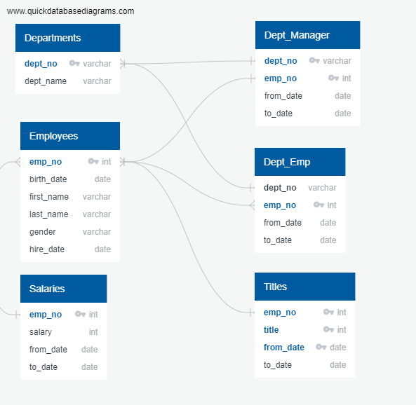

# Pewlett-Hackard-Analysis

## Overview
Several employees are approaching retirement age at fictional tech giant Pewlett Hackard.  In order to assist senior leadership in preparing for this "silver tsunami", PH needs to determine the number of retiring employees.  Senior leadership at PH would also like to fill these positions with up-and-coming star employees and allow them the opportunity to gain institutional knowledge and additional skills, so they have also asked for employees who are eligible to participate in a mentorship program.


## Resources:
- Software:
    - Postgresql
    - pgAdmin
- Data Sources:
    - [departments.csv](https://github.com/acfthomson/Pewlett-Hackard-Analysis/tree/main/Data)
    - [dept_emp.csv](https://github.com/acfthomson/Pewlett-Hackard-Analysis/tree/main/Data)
    - [dept_manager.csv](https://github.com/acfthomson/Pewlett-Hackard-Analysis/tree/main/Data)
    - [employee.csv](https://github.com/acfthomson/Pewlett-Hackard-Analysis/tree/main/Data)
    - [salaries.csv](https://github.com/acfthomson/Pewlett-Hackard-Analysis/tree/main/Data)
    - [titles.csv](https://github.com/acfthomson/Pewlett-Hackard-Analysis/tree/main/Data)
    
    
## Results
Using queries and joins to create a list of retiring PH employees and employees eligible for PH's mentorship program, it was important to first understand the relationship between the various tables in the PH-EmployeeDB.  Using an Entity Relationship Diagram (ERD) allowed the database admins and analysts to quickly determine how the data is connected, the data types, and primary keys.

### PH-Employee DB ERD


###
In order to determine the number of employees approaching retirement eligibility, a new table, [retirement_titles]((https://github.com/acfthomson/Pewlett-Hackard-Analysis/tree/main/Data) was created by using the following query:
``` SQL
SELECT e.emp_no,
	   e.first_name,
	   e.last_name,
	   t.title,
	   t.from_date,
	   t.to_date
INTO retirement_titles
FROM employees AS e
LEFT JOIN titles AS t
ON (e.emp_no = t.emp_no)
WHERE (e.birth_date BETWEEN '1952-01-01' AND '1955-12-31')
ORDER BY e.emp_no, title;
```
This resulted in a table with 133,776 rows and several duplicate names, which was due to an employee changing job titles.


    There is a bulleted list with four major points from the two analysis deliverables. (6 pt)

Summary:

    The summary addresses the two questions and contains two additional queries or tables that may provide more insight. (5 pt)

